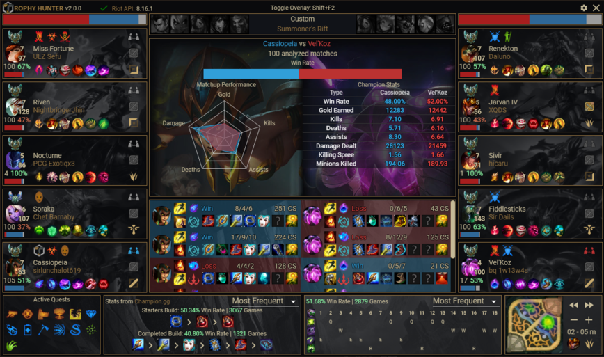
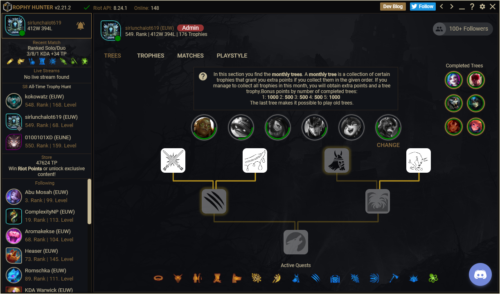

# Trophy Hunter

Earn trophies while playing League of Legends, view information about your teammates and opponents and meet other hunters to play with.

Trophy Hunter is a League of Legends app for [Overwolf](https://www.overwolf.com/).

## Table of content

- [Download](#download)
- [Features](#features)
  - [Overlay](#overlay)
  - [Main](#main)
- [Develop](#develop)
  - [Storybook](#storybook)
  - [App](#app)
- [Contribute](#contribute)

## Download

You can download the app from in the [Overwolf App Store](https://www.overwolf.com/app/trophy_hunter-trophy_hunter).

## Features

- Rich stats for opponents and teammates including rank, KDA, accuracy and more
- Build Guide - not sure what is the best build for you? Trophy Hunter will - guide you in-game
- Forget Alt-Tab! Use this app as a smart overlay in-game
- The best part! You can earn League of Legends trophies and redeem as RP!

More details [here](https://play.overwolf.com/trophy-hunter/).

### Overlay

  

### Main

  

## Develop

Clone this project with activated symlink support on Windows with `git clone -c core.symlinks=true git@github.com:lmachens/trophy-hunter.git`.

### Storybook

We added storybook to allow developing of React components.
`npm run storybook` will process all `.stories.js` files.

### App

Please follow the instructions on [Overwolf Developer](http://developers.overwolf.com/documentation/odk-2-0-introduction/creating-your-first-app/) to get white listed and sign up on [Riot Developer](https://developer.riotgames.com/) for the Riot API key. Without these requirements, you can only use core features in your Browser.

1. Install [MongoDB](https://www.mongodb.com/de/download-center) and run it on port 27017
1. Install [Meteor](https://www.meteor.com/install)
1. Install dependencies with `meteor npm install`
1. Copy `template.settings.json` to `app/settings.json`.
1. Start the dev server with `meteor npm run app`. The app is available on http://localhost:3000.
1. Download the [Developers version of Overwolf](https://download.overwolf.com/install/Download?Channel=Developers). You can skip this step if you already installed Overwolf.
1. Start Overwolf and click on Settings (either the wrench icon on the dock, or the Settings button on the tray icon menu).
1. Go to the Support tab, you will see a link labelled "Development Options". Click that.
1. Click on "Load unpacked extension" and navigate to `overwolf/dist/development`.
1. The app will connect to http://localhost:3000.

## Contribute

Contributions are always welcome! Please contact us in [Discord](https://discord.gg/8NEYhR).
